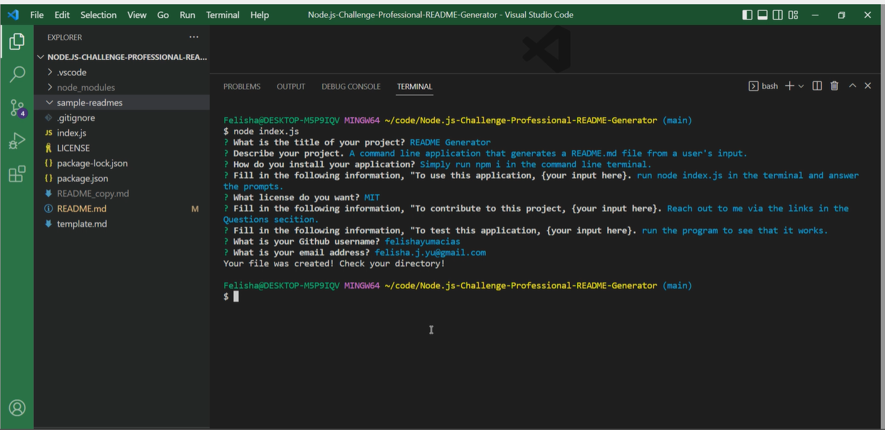

# Node.js Challenge Professional README Generator
## Description

Module 9 Challenge
### User Story

```md
AS A developer
I WANT a README generator
SO THAT I can quickly create a professional README for a new project
```

### Acceptance Criteria

```md
GIVEN a command-line application that accepts user input
WHEN I am prompted for information about my application repository
THEN a high-quality, professional README.md is generated with the title of my project and sections entitled Description, Table of Contents, Installation, Usage, License, Contributing, Tests, and Questions
WHEN I enter my project title
THEN this is displayed as the title of the README
WHEN I enter a description, installation instructions, usage information, contribution guidelines, and test instructions
THEN this information is added to the sections of the README entitled Description, Installation, Usage, Contributing, and Tests
WHEN I choose a license for my application from a list of options
THEN a badge for that license is added near the top of the README and a notice is added to the section of the README entitled License that explains which license the application is covered under
WHEN I enter my GitHub username
THEN this is added to the section of the README entitled Questions, with a link to my GitHub profile
WHEN I enter my email address
THEN this is added to the section of the README entitled Questions, with instructions on how to reach me with additional questions
WHEN I click on the links in the Table of Contents
THEN I am taken to the corresponding section of the README
```

## Table of Contents (Optional)

- [Installation](#installation)
- [Usage](#usage)
- [Credits](#credits)
- [License](#license)

## Installation

*   If you do not have node.js installed click the link below to install the LTS version.

    https://nodejs.org/en/


*   Right click on index.js and select "Open in Integrated Terminal"

*   If you do not have the npm packages (a package.json file does not exist) then run the following command to create the package.json and automatically accept defaults. 
```md 
npm init -y
``` 
*   Then run the following command to install the correct version of inquirer.
 ``` md 
 npm i inquirer@
 ``` 
    
## Usage

Once everything is installed run the following command and answer prompts to create your README file.
```md
node index.js
``` 

See video below for walkthrough.

https://drive.google.com/file/d/15kAYTe6CI6bnywl_2Sd_kJLS41H4-5b9/view

### Screenshot




## Credits

Inquirer NPM
https://www.npmjs.com/package/inquirer

Basic Markdown Syntax
https://www.markdownguide.org/basic-syntax/#code-blocks

Github Repository Link
https://github.com/FelishaYuMacias/Node.js-Challenge-Professional-README-Generator

Link to Walkthrough Recording
https://drive.google.com/file/d/15kAYTe6CI6bnywl_2Sd_kJLS41H4-5b9/view


## License

MIT License

Copyright (c) 2022 Felisha

Permission is hereby granted, free of charge, to any person obtaining a copy
of this software and associated documentation files (the "Software"), to deal
in the Software without restriction, including without limitation the rights
to use, copy, modify, merge, publish, distribute, sublicense, and/or sell
copies of the Software, and to permit persons to whom the Software is
furnished to do so, subject to the following conditions:

The above copyright notice and this permission notice shall be included in all
copies or substantial portions of the Software.

THE SOFTWARE IS PROVIDED "AS IS", WITHOUT WARRANTY OF ANY KIND, EXPRESS OR
IMPLIED, INCLUDING BUT NOT LIMITED TO THE WARRANTIES OF MERCHANTABILITY,
FITNESS FOR A PARTICULAR PURPOSE AND NONINFRINGEMENT. IN NO EVENT SHALL THE
AUTHORS OR COPYRIGHT HOLDERS BE LIABLE FOR ANY CLAIM, DAMAGES OR OTHER
LIABILITY, WHETHER IN AN ACTION OF CONTRACT, TORT OR OTHERWISE, ARISING FROM,
OUT OF OR IN CONNECTION WITH THE SOFTWARE OR THE USE OR OTHER DEALINGS IN THE
SOFTWARE.


